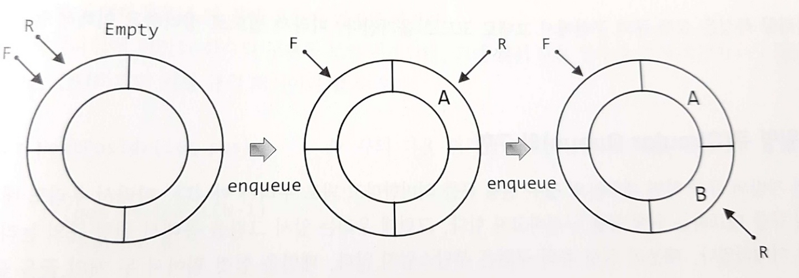
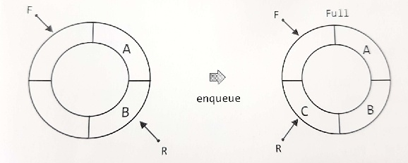

# Circular Queue

큐를 원형으로 만들지 않으면 문제가 생길 수 있다. 그 이유는 데이터를 계속해서 집어넣을 수 없을 뿐더러, 데이터를 꺼내고 나서는 그 공간을 다시는 활용할 수 없는 형태이기 때문이다. 그래서 큐는 보통 원형으로 만든다. 

> 이때 링 버퍼 개념을 생각해볼 수 있다. [https://velog.io/@fenta0917/05.RingBuffer](https://velog.io/@fenta0917/05.RingBuffer) 

이 버퍼 링과 유사한 방식으로 Circular Queue를 만들어 볼 수 있다. 원형 큐의 경우 맨 처음 front와 rear이 같은 위치(0)를 가리킨다. 이때 enqueue가 발생하면 아래 사진과 같은 상황이 된다. 

여기서 중요한 것은 front 는 첫번째 요소 하나 앞에 인덱스를 가리키는 반면, back는 마지막 요소를 가리키고 있다는 것!

- 처음 시작 할 때는 front와 rear가 같은곳을 가르키고 있다.
- enqueue 연산 시 R이 가리키는 위치를 한 칸 이동시킨 다음, R이 가리키는 위치에 데이터를 저장한다.
- dequeue 연산 시 F가 가리키는 위치를 한 칸 이동시킨 다음에 , F가 가리키는 위치에 저장된 데이터를 반환 및 소멸한다.

처음 시작 할 때는 front와 rear이 같은 곳을 가리키고 있지만 포화 상태일 때는 front와 rear이 한칸 차이가 난다. 왜냐하면 포화 상태 일때도 모든 공간을 다 사용하게 된다면 front와 rear이 같은곳을 가리키게 되므로 공백상태와 포화 상태가 구분이 안가는 것이다. 그렇기에 한탄을 띄어 놓는다.

따라서 원형큐의 특성을 다음 두가지로 추가 정리 할 수 있다.

- 원형큐가 텅 빈 상태 : F와 R이 동일한 위치를 가리킨다.
- 원형큐가 꽉 찬 상태 : R이 가리키는 위치의 앞을 F가 가리킨다.