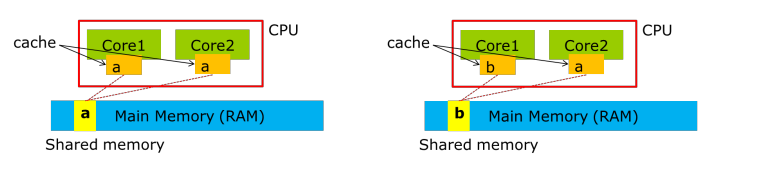

# Quiz & Debate

## (1) When does a process exit from the running state? Give three examples.

1. Running -> Waiting
2. TimerunOut
3. terminated(exit)

## (2) What is a process context? Describe the actions taken by kernel to context-switch between processes.

Context switch에 의해 CPU에 올라가있는 프로세스가 바뀔 수 있는데, 그 때 우리는 원래 실행하고 있던 프로세스의 정보를 기록해 놓아야 한다. 그것을 우리는 process Context라고 하며 PCB에 process Context를 저장하고, 나중에 OS가 담당하는 context-switch을 통해서 저장된 state를 가져오게 된다.

## (3) Solve question 2 and question 3 in the next slides. getpid() system call

returns the process id (pid) of caller process.

Question2:

A: 0

> pid == 0 일때 pid값은 0임
> B: 2603
> getpid(); 를 child가 실행하면 child 의 pid가 리턴된다
> C: 2603
> parent가 fork(); 리턴하면 2603이다.
> D: 2600
> parent가 getpid(); 을 실행하면 리턴값은 2600이다.

Question3:

> Parent가 fork(); 를 할 때, 독립적인 공간을 만들어내고 그 공간은 Child라고 부른다. 이때 child의 value값은 20이 맞지만 parent는 child의 value에 영향을 받지 않으므로 값은 5이다.

## (4) Explain why the cache coherence problem happens when using shared

memory for multicore CPUs

CPU는 가장 가까이에 있는 데이터를 가져오는 경향이 있다. 그래야 속도가 빠르기 때문이다. 그런데 shared memory에 저장된 데이터가 한 코어에 의해서만 변경된다면, 나머지 코어는 캐시에 이미 기존의 데이터가 위치하기 때문에 cpu의 캐시에서 값 충돌이 일어나게 된다.
